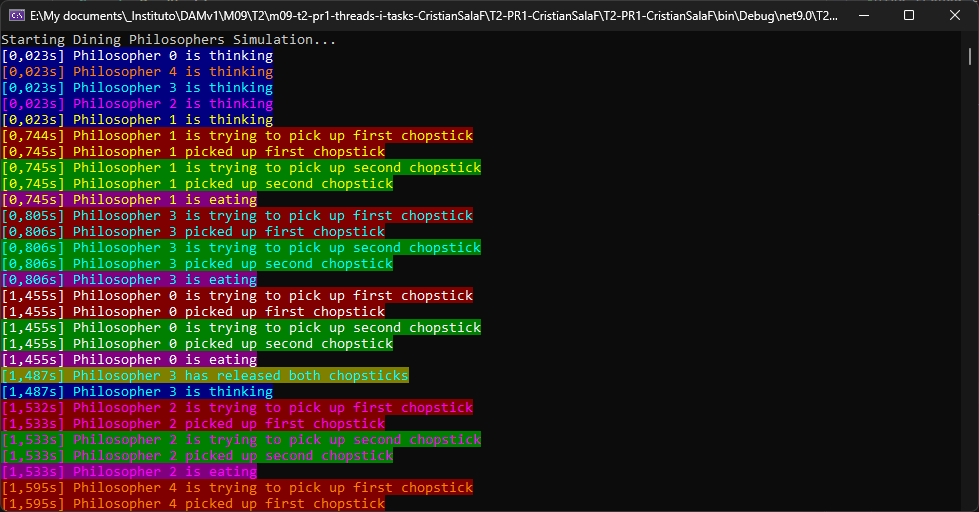
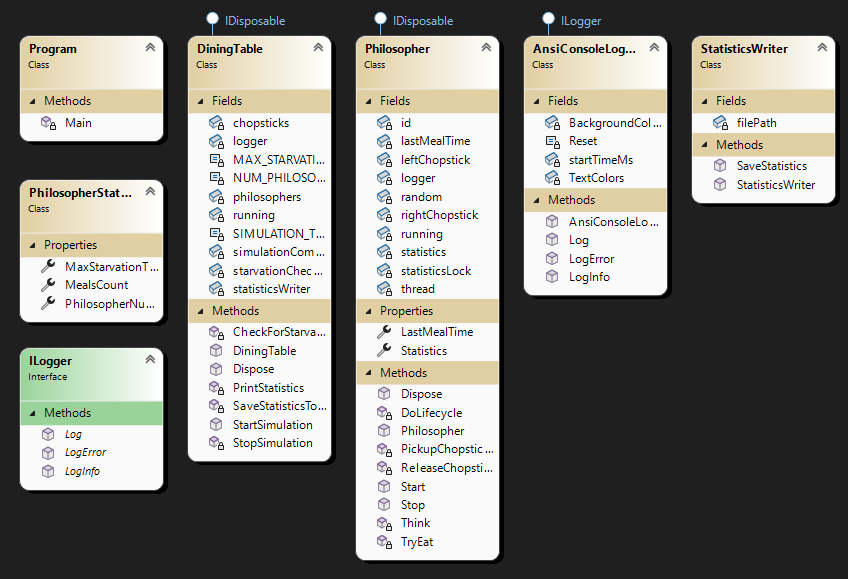

## Sol·lució proposada:
### Prevenció de bloquejos:

Els filòsofs parells trien primer el pal esquerre, els filòsofs senars trien primer el pal dret.
Això trenca la condició d'espera circular.

### Adminstració del cicle de vida amb IDisposable
Implementar IDisposable permet tancar els fils de treball correctament quan l'objecte ja no és necessari. 
Això garanteix que els recursos (com ara un fil de fons) s'alliberin correctament quan es crida Dispose(), 
igual que tancar els identificadors de fitxers o les connexions a la base de dades.

Exemple d'avantatge: quan l'aplicació es tanca o l'objecte es descarta, no deixarà els fils penjats en segon pla, 
cosa que evitarà fuites de memòria o processos orfes.

### Sortida acolorida:

Utilitza codis d'escapada ANSI `\u001b[XXm` en lloc de `Console.Color`.
Colors de text diferents per a cada filòsof.
Colors de fons diferents per a cada estat (pensar, esperar, menjar, etc.).

### Detecció de fam:

Controla constantment el temps des de l'últim àpat per a cada filòsof.
Finalitza la simulació si algun filòsof no ha menjat durant més de 15 segons.

### Seguiment d'estadístiques:

Seguiment del temps màxim de fam i del recompte d'àpats per a cada filòsof.
Emet estadístiques a la consola i al fitxer CSV.

## Enunciat 1 - Dades d’anàlisi
- Quants comensals han passat fam? I quin temps de mitjana?
  - Els comensals passen fam una mitjana de 2.7 segons, recopilat de 5 execucions.
- Quantes vegades ha menjat cada comensal de mitjana?
  - 15 vegades
- Record de vegades que ha menjat un mateix comensal
  - 17 vegades
- Record de menys vegades que ha menjat un comensal.
  - 13 vegades (una única vegada)

Dos de les mostres (resultats):

| Filòsof 	| Gana màxima (s) 	| Menjars totals 	|
|---------	|-----------------	|----------------	|
| 0         | 2.689             | 15             	|
| 1         | 2.948             | 15             	|
| 2         | 2.641             | 14             	|
| 3         | 2.720             | 16             	|
| 4         | 2.923             | 16             	|

| Filòsof 	| Gana màxima (s) 	| Menjars totals 	|
|---------	|-----------------	|----------------	|
| 0       	| 2.764           	| 16             	|
| 1       	| 2.788           	| 14             	|
| 2       	| 2.628           	| 14             	|
| 3       	| 2.735           	| 14             	|
| 4       	| 2.687           	| 16             	|

### Esquema
